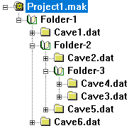

<!-- Source: https://fountainware.com/compass/HTML_Help/Project_Manager/projectfileformat.htm -->

# The Project File Format: MAK File

Normally, you would create Project or "MAK" files using the Project Manager.
Occasionally, someone might like to create a Project File in some other way. For
example, you might want to create a Project File using a database. For this
reason, this section of the document covers the actual internal format of the
Project File. If you are not a programmer, you can skip this section.

Generally speaking, a Project File is just an ASCII text file. Thus, it is very
easy to create Project Files using a text editor, word processor, database or
spreadsheet. Here is a detailed explanation of the different parts:

- [Base Location](#base-location)
- [The File List](#the-file-list)
- [Folders](#folders)
- [Fixed Stations](#fixed-stations)
- [Linking](#linking)
- [Parameters](#parameters)

## Base Location

Compass allows you to enter a base location for a cave or cave system. The Base
Location is used for calculating Magnetic Declination. It allows you make
Magnetic Declination calculations even when you don't have any fixed stations
associated with any of the surveys.

Here is an example of a Base Location in a Compass `MAK` file:

```make
@398315.500,4483735.300,3048.000,13,0.780;
&North American 1983;
```

1. The `@` Parameter. This parameter indicates the base location of the cave.
   Since the value is only used to calculate Magnetic Declination, it does not
   have to be the entrance or specific location in the cave. All that is
   necessary is. Five values are specified in the command. Here is a description
   of each value in the order:

   1. UTM East. The first value specifies the standard UTM-East distance in
      meters.

   1. UTM North. This value specified the standard UTM-North distance in meters.

   1. Elevation. This value specifies the elevation in meters.

   1. Zone. This value specified the UTM zone number.

   1. Convergence Angle. This value is the UTM convergence angle between the UTM
      grid and the line longitude.

1. The `&` Parameter. This parameter specifies the Datum used in geographic
   conversion operations. The Datum is specified as a string which must match
   exactly one of the Datums displayed in the Compass Geographic Calculator.

## The File List

Basically, a Project File just consists of a list of files that will be
combined. As an example, here is a simple project file:

```make
#DEEP1.DAT;
#DEEP2.DAT;
#DEEP3.DAT;
```

As you can see, it is a list of filenames. Each line begins with a pound sign
`#` and ends with a semicolon `;`. All other lines are ignored by the program
and can be used for notes or comments. After the pound sign, a file name must
appear. This can be any file name and can include a
[path](https://fountainware.com/compass/HTML_Help/Project_Manager/pathdef.htm)
specification. Spaces, tabs, carriage returns, line feeds and all "white space"
characters are ignored. Comments begin with a forward slash `/` and are
terminated either by another forward slash or the end of the line. The "make"
format allows a great deal of freedom in the way you can lay out the file. The
format allows the files and linking information to be set up virtually free
form.

## Folders

Compass allows for the creation of folders within a Project File. Folders allow
you to organize cave data into separate logical sections. For example, if you a
large cave, you could put different areas of a cave into separate folders.
Likewise, if you have project that contains multiple caves, you could group
caves from specific a specific area together. Each folder can be processed and
viewed separately.

In a MAK file, folders are specified by angle brackets. The beginning of a
folder is specified by a left angle bracket followed by the name of the folder
and ending with a Semicolon. For example:

```make
[Mouse Palace;
```

A folders ends with a right angle bracket and a semicolon:

```make
];
```

Folder can be placed anywhere in the MAK file, however, every left angle bracket
must eventually be matched with a right angle bracket. Folders can be nested
arbitrarily deep.

Here is an example MAK file with folders nested three levels deep. The tree on
the right shows the result tree structure produced by the MAK file

<table>
<tr>
<td>

```make
[Folder-1;
  #cave1.dat;
  [Folder-2;
    #cave2.dat;
    [Folder-3;
      #cave3.dat;
      #cave4.dat;
    ];
    #cave5.dat;
  ];
  #cave6.dat;
];
```

</td>
<td>



</td>
</tr>
</table>

## Fixed Stations

It is sometimes useful to set the location of a survey station to a fixed set of
coordinates. For example, this is useful when you have the coordinates for the
entrances of several caves and you want to tie them together into a single
survey.

You can set the location of a station by placing the station name in the list of
links for a survey. The station name is then followed by the coordinates for the
fixed location you want to use enclosed in “square brackets” “[]”. The
coordinates item begins with a “Units” command that specifies the unit that
should be used for the location coordinates. The letter F means that feet are
used, the letter M means that meters are used. This is followed by the east,
north and vertical coordinates of the fixed location. Each item in the
measurement units and the coordinates can be separated by commas, spaces or any
other character that cannot be interpreted as part of the Units Command or the
coordinate numbers.

```make
#TEST1.DAT,A1[F,10.1,20.2,30.3];
#TEST2.DAT,C1[M,1.2,2.3,3.4];
```

The example entry links together two survey files, TEST1 and TEST2. In the first
file, the station A1 is fixed to the location 10.1 east, 20.2 north and 30.3
vertical and the units are in feet. The second file has one fixed station. The
coordinates for this fixed station are specified in meters.

## Linking

"Linking" is a technique that was necessary under DOS where memory was limited.
Under Windows, which gives programs access to large blocks of
[memory](https://fountainware.com/compass/HTML_Help/Project_Manager/winmemory.htm),
linking is seldom necessary.

Basically, "links" are a method of connecting the two files together. Links
specify the stations in the old file that connect to the new file. For example,
if the shot B22 to CD1 connects the old file to the new file, then B22 is the
link and you would use it as a link. You can have up to 500 links between files.
The value of linking is that after the compiler has been given all the linking
stations, it can forget all other stations in the old file. This frees up a
large block of memory.

Even though Windows generally gives you enough memory so that linking is
unnecessary, there are still situations where linking is useful. First of all,
since it frees memory, it could be used to combine several large caves into a
huge cave system. Second, linked files compile slightly faster. Finally, with
linking, you can combine two caves that have duplicate survey names. Normally,
you would have to rename all conflicting stations; but with linking, the program
"forgets" all the stations in the old file so there is no conflict.

Link stations should be placed in the make file after the filename. If there is
more than one link station they should be separated by commas. Here is a simple
example:

`#OLDCAVE.DAT;` `#NEWCAVE.DAT,B22,C17;`

In this example, B22 and C17 are linking stations between OLDCAVE and NEWCAVE.
You will notice that OLDCAVE has no links. This is because it is the first file
to processed, and it does not need to be connected to a previous file. You can
combine links and [fixed stations](overlinking.htm) like this:

`#TEST2.DAT,AB4,C1[M,1.2,2.3,3.4],C12;`

If you are working with three or more files, you have to plan ahead. This is
because you may have links between the first file and the third file. Since the
program erases everything but the link stations between files, you must be sure
to carry all the links from the first to the third file. Look at the following
example:

`  FILE1  -  (No links)` `  FILE2  -  Needs: A22 (From FILE1)`
`  FILE3  -  Needs: A16 (From FILE1), B14 (From FILE2)`

FILE2 needs A22 as a link from FILE1. FILE3 needs two links, A16 from FILE1 and
B14 from FILE2. Since FILE2 is processed before FILE3, and FILE3 needs A16 from
FILE1, you must carry A16 into FILE2 even though FILE2 doesn't need it for its
own processing. This is the way the Make file would look:

`  #FILE1.DAT;        /no links` `  #FILE2.DAT,A22,A16;` `  #FILE3.DAT,A16,B14;`

The following Make file for Wind Cave illustrates a complex Make file. (Under
Windows, this kind of complex Make file is no longer necessary unless your have
duplicate station names.)

`#WIND1.DAT;`

`#WIND2.DAT,` `C41,F12,P9,C41,C40,UG30,NFP1,C39,SA'12,PP3, /from Wind1 to Wind2`
`JF65,JF109,L*6,JF10,             /from Wind1 to Wind3`
`KX37R,KY258R,JW1R,KY357,         /from Wind1 to Wind5`
`CR1,KK32,SA9R,BX21,KK32;         /from Wind1 to Wind4`

`#WIND3.DAT,` `JF65,JF109,L*6,JF10,             /from Wind1 to Wind3`
`KX37R,KY258R,JW1R,KY357,         /from Wind1 to Wind5`
`CR1,KK32,SA9R,BX21,KK32;         /from Wind1 to Wind4`

`#WIND4.DAT,` `KX37R,KY258R,JW1R,KY357,         /from Wind1 to Wind5`
`CR1,KK32,SA9R,BX21,KK32,         /from Wind1 to Wind4`
`MP74,MP28,PC2,KY349,KY326,       /from Wind3 to Wind5`
`AA29,AA30,AA32,CR4,PC7,ZB1;      /from Wind3 to Wind4`

`#WIND5.DAT,` `SE202,                           /from Wind4 to Wind6`
`KX37R,KY258R,JW1R,KY357,         /from Wind1 to Wind5`
`MP74,MP28,PC2,KY349,KY326,       /from Wind3 to Wind5`
`KK20,K29,KK26,KF14,BB35,BB37,KQ45, /from Wind4 to Wind5`
`KA1,KO4,KI24,KK33,KK37,KK41,KK53,BB33,SD15;`

`#WIND6.DAT,` `SE202;                           /from Wind4 to Wind6`

## Parameters

There are two additional parameters that can be specified in a Project File.
Each one is specified by a special character. The information is terminated with
a semicolon “;”.

Here is a list of the parameters:

**1. UTM Convergence.** Convergence is an angle value that is used to align the
cave map to the
[UTM grid](https://fountainware.com/compass/HTML_Help/Project_Manager/geounit.htm).
[Click here](https://fountainware.com/compass/HTML_Help/Project_Manager/declination_and_convergence.htm)
for detailed information on Convergence. The Convergence Angle parameter begins
with either a percent sign `%` or a star `*` and ends with a semicolon `;`. The
convergence value is found inside the delimiters and can be any ASCII fixed or
floating point number.

For example:

- `%12.34;`
- `*12.34;`

The percent sign `%` symbol indicates that file-level convergence is enabled.
The star `*` symbol indicates that the file-level convergence is disabled.

**2. UTM Zone.** The [UTM coordinate system](geounit.htm) divides the world up
into zones. This parameter allows you to specify the zone that will be used for
the fixed stations defined in the project file. The Zone parameter begins with a
dollar sign ($) and ends with a semicolon (;). The Zone value is found inside
the dollar-semicolon pair and can be any ASCII integer value.

For example: `$12;`

**3. Project Parameters**. These parameter specifies a series flags that are
saved with the Project file. As such, when they are enabled, they override the
lower level options and settings.

The flag string begins with an Exclamation Point `!` and ends with a Semicolon
`;`.

Here is a list of the flags:

1. **"G" or "g".** This flag controls whether all settings are globally
   overridden by projects settings. A capital letter enables the option; lower
   case disables it.

1. **"I", "E", "A".** This flag controls how declinations are derived and
   processed. An "I" indicates that Declinations are ignored. An "E" indicates
   that the declinations entered in the survey book should be used and an "A"
   indicates they should be calculated from the survey date and the geographic
   location.

1. **"V" or "v".** This flag indicates whether UTM convergence should be applied
   to the data. A capital letter enables the option; lower case disables it.

1. **"O" or "o".** This flag controls overriding LRUD association settings. If
   the flag is set to capital "O." all other methods of controlling the LRUD
   associations are overridden.

1. **"T" or "t".** This flag specifies how the LRUD associations are overridden
   if the "O" flag is set. If the flag is set to capital "T," all surveys are
   compiled with the LRUDs associated with the "To" stations. If the flag is set
   to lower case "t", all surveys are compiled with the LRUDs associated with
   the "From" station.

1. **"S" or "s".** This option indicates whether shot flags are applied. A
   capital letter enables the option; lower case disables it.

1. **"X" or "x".** This option indicates whether the "X" total exclusion flags
   are applied. A capital letter enables the option; lower case disables.

1. **"P" or "p".** This option indicates whether the "P" plotting exclusion
   flags are applied. A capital letter enables the option; lower case disables.

1. **"L" or "l".** This option indicates whether the "P" length exclusion flags
   are applied. A capital letter enables the option; lower case disables.

1. **"C" or "c".** This option indicates whether the "C" close-exclusion flags
   are applied. A capital letter enables the option; lower case disables it.

Example: `!GAVOTSCXPL;`

For detailed information on the parameters, refer to the
[Settings Overview.](https://fountainware.com/compass/HTML_Help/Project_Manager/settings_overview.htm)
